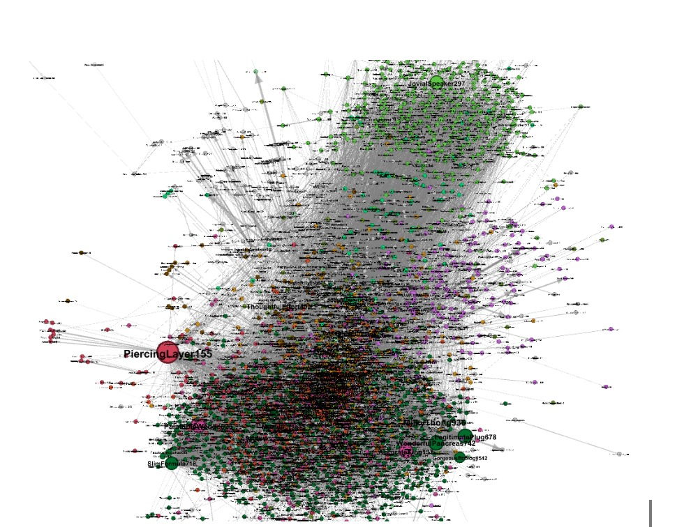

# Analyzing Instagram Data Set using Graphs

---

 Using graph analysis, analyze the instagram data set available in Kaggle to find out the most influential members of the network to increase sales by advertisement. The dataset was too large to process, we therefore had to do exploratory data analysis to check how to reduce it so that it doesn't become a random network.

 

 
